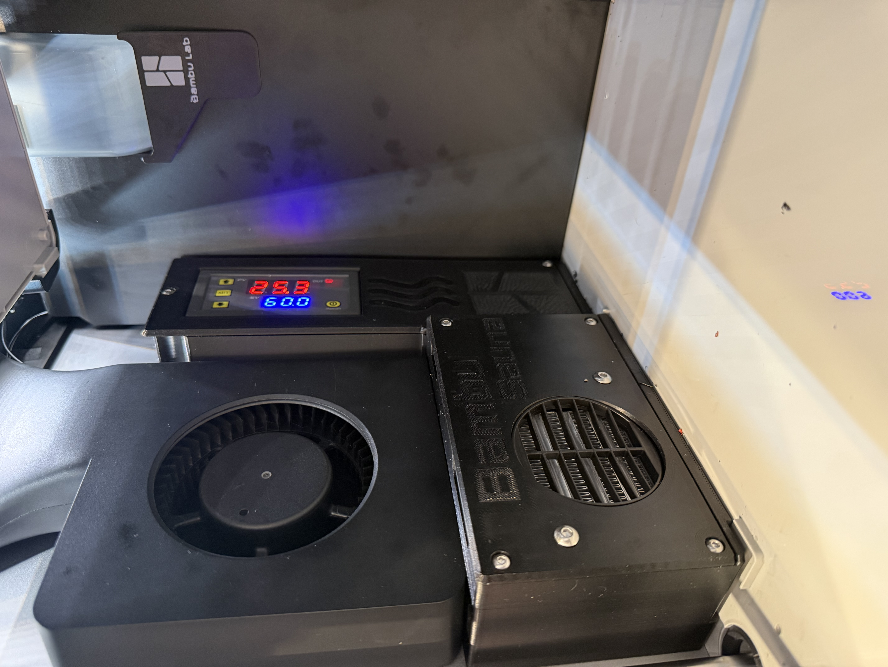
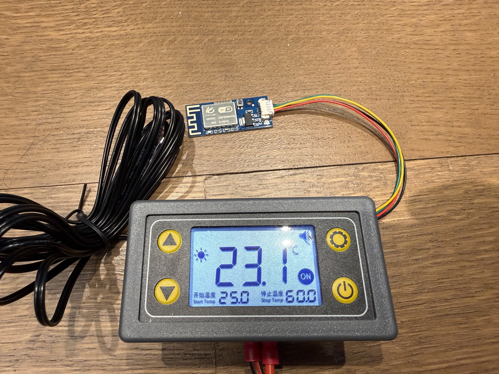
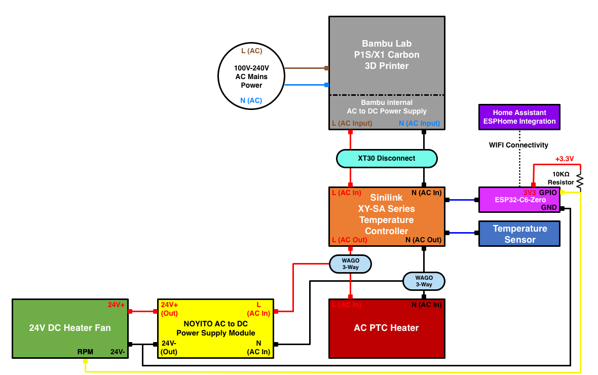
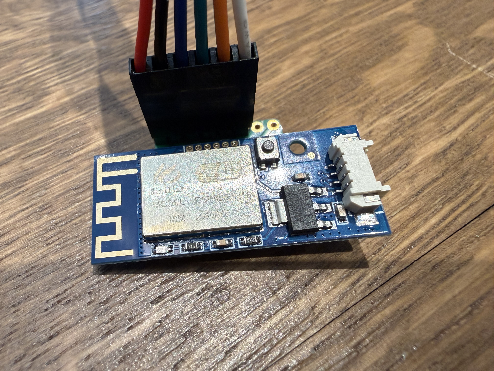
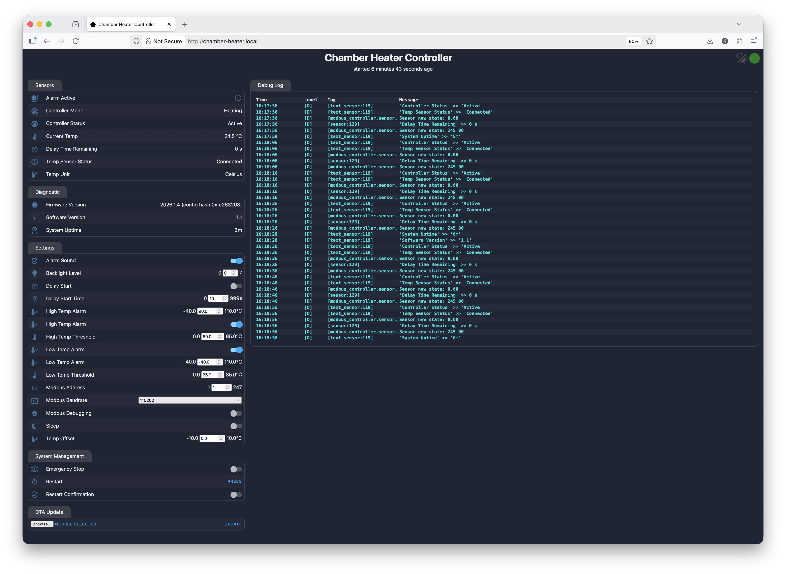

# Bambu Chamber Heater - ESPHome Controller
ESPHome implementation to remotely control Sinilink **XY-SA/ST series temperature controllers** using the **XY-WFPOW (ESP8285-based)** module. Designed specifically to work with *Bambu Lab P1S/X1 Carbon 3D printers* and integration with Home Assistant or managed with the web interface. 

This project allows you to intelligently manage your chamber heater by turning it on/off automatically, linking it with print jobs, and controlling it with automation scripts. Inspired by the [BambuSauna project](https://makerworld.com/en/models/539096-bambusauna-bambulab-x1c-p1p-p1s-chamber-heater).  




## Features
- Remote control of chamber heater via ESPHome integration
- Supports automation scripting using Home Assistant
- OTA (Over-The-Air) firmware update
- Web server interface with customizable UI and remote monitoring

## Requirements
Make sure you have the following before proceeding:

- ESPHome build environment installed locally (instructions below).
- USB-to-TTL UART Programmer (Note: I highly recommend FTDI-based programmers)
- Bambu P1S / X1 Carbon 3D Printer
- Sinilink XY-SA/ST temperature controller with XY-WFPOW wireless module

## References
- [Sinilink XY-ST/SA Remote Thermostat Datasheet](https://myosuploads3.banggood.com/products/20240220/20240220213226STSA-EN.pdf)
- [Sinilink XY-WT04 Modbus Communication Protocol](https://myosuploads3.banggood.com/products/20220717/20220717212911XY-WT04-EN.pdf)

## Wiring Diagram
Here is a basic wiring diagram for AC-powered Sinilink XY-SA Series Temperature Controllers. The Sinilink XY-ST Series Temperature Controllers are DC-powered and require an external 24V power supply and entirely different wiring schematic. 



Disclaimer: The author assumes no liability for any injury, damage, or loss resulting from wiring errors, improper installation, or misuse of this project. Electrical work can be hazardous—if you are unsure, consult a qualified professional before proceeding.

## Setup & Installation

### 1. Install ESPHome
Follow the instructions at the official ESPHome website: [ESPHome.io website](https://esphome.io/guides/installing_esphome/).

If you're using MacOS, the easiest way to install is via [Homebrew](https://brew.sh/) by running this command in a MacOS terminal window:
```
/bin/bash -c "$(curl -fsSL https://raw.githubusercontent.com/Homebrew/install/HEAD/install.sh)"
```
Now install ESPHome:
```
brew install esphome
```

### 2. Clone Repository
```
git clone https://github.com/kedube/bambu-chamber-heater
cd bambu-chamber-heater
```

### 3. Configure Secrets
Copy the default secrets file and update it with your credentials & Wi-Fi:
```
cp secrets-example.yaml secrets.yaml
```

Configurable settings:
```
wifi_ssid: ""
wifi_password: ""
wifi_default_ssid: "bambu-chamber-heater"
wifi_default_password: ""
web_server_username: "admin"
web_server_password: ""
ota_password: ""
encryption_key: ""
```

Generate a valid 32-byte encryption key (see: [ESPHome.io](https://esphome.io/components/api/)), and insert it under `encryption_key`.

### 4. Choose Temperature Unit
By default, the code uses Celsius. To use Fahrenheit, uncomment the appropriate yaml package in 'temperature_controller.yaml':
```
packages:
  select_units: !include 
    # Select the appropriate temperature unit file to include based on your preference. 
    # Both files define the same entities, but with different units and value ranges.
    #file: celsius.yaml
    file: fahrenheit.yaml
```

### 5. Compile the yaml files
Compile the ESPHome code:
```
esphome run temperature_controller.yaml
```

### 6. Flash the ESP8285 module with ESPHome
The **XY-WFPOW pinout** can be found here:

- [ESPhome-Sinilink-XY-WFPOW GitHub Repository](https://github.com/creepystefan/ESPhome-Sinilink-XY-WFPOW)
- [Tasmota's website](https://templates.blakadder.com/sinilink_XY-WFPOW.html)https://templates.blakadder.com/sinilink_XY-WFPOW.html

Your USB-to-TTL UART programmer **must be set to 3.3 V**. To flash the module, you must connect all **five pins** between the programmer and the XY-WFPOW (including `IO0` to `GND` for flashing).


```
    GNG → GND
    TXD → RXD
    RXD → TXD
    IO0 → GND
    RST (not connected)
    3V3 → VCC
```

I used an **8-pin pitch-changer prototype board** to adapt the **1.27 mm** module pins to **2.54 mm** spacing, but only populated 6 pins. The 1.27 mm pins fit snugly into the module’s holes, providing a reliable connection. As an alternative, you can use **24 AWG Ethernet cable**—the bare copper conductors fit tightly into the module’s pin holes and work well for the initial programming.




Once ESPHome successfully compiles the YAML configuration, it will prompt you to flash the **ESP8285** module if a USB-to-TTL programmer is connected to your computer.

```
Linking .pioenvs/bambu-chamber-heater/firmware.elf
RAM:   [====      ]  44.4% (used 36380 bytes from 81920 bytes)
Flash: [=====     ]  54.9% (used 562413 bytes from 1023984 bytes)
Building .pioenvs/bambu-chamber-heater/firmware.bin
esp8266_copy_factory_bin([".pioenvs/bambu-chamber-heater/firmware.bin"], [".pioenvs/bambu-chamber-heater/firmware.elf"])
esp8266_copy_ota_bin([".pioenvs/bambu-chamber-heater/firmware.bin"], [".pioenvs/bambu-chamber-heater/firmware.elf"])
========================================================================== [SUCCESS] Took 30.71 seconds ==========================================================================
INFO Successfully compiled program.
Found multiple options for uploading, please choose one:
  [1] /dev/cu.usbserial-BG031LIB (FT232R USB UART)
  [2] Over The Air (chamber-heater.local)
(number): 1
esptool v5.1.0
Connected to ESP8266 on /dev/cu.usbserial-BG031LIB:
Chip type:          ESP8285H16
Features:           Wi-Fi, 160MHz, Embedded Flash
Crystal frequency:  26MHz
MAC:                14:08:08:6c:e4:19

Stub flasher running.
Changing baud rate to 460800...
Changed.

Configuring flash size...
Auto-detected flash size: 2MB
Flash will be erased from 0x00000000 to 0x0008afff...
Flash parameters set to 0x0330.
Compressed 566560 bytes to 396530...
Wrote 566560 bytes (396530 compressed) at 0x00000000 in 9.6 seconds (473.6 kbit/s).
Hash of data verified.

Hard resetting via RTS pin...
INFO Successfully uploaded program.
INFO UART logging is disabled (baud_rate=0). Not starting UART logs.
```

The USB-to-TTL programmer is required **only for the initial flash**. After that, all future updates can be deployed using **ESPHome Over-The-Air (OTA)** once the configuration compiles successfully.

```
Linking .pioenvs/bambu-chamber-heater/firmware.elf
RAM:   [====      ]  44.4% (used 36380 bytes from 81920 bytes)
Flash: [=====     ]  54.9% (used 562413 bytes from 1023984 bytes)
Building .pioenvs/bambu-chamber-heater/firmware.bin
esp8266_copy_factory_bin([".pioenvs/bambu-chamber-heater/firmware.bin"], [".pioenvs/bambu-chamber-heater/firmware.elf"])
esp8266_copy_ota_bin([".pioenvs/bambu-chamber-heater/firmware.bin"], [".pioenvs/bambu-chamber-heater/firmware.elf"])
========================================================================== [SUCCESS] Took 3.38 seconds ==========================================================================
INFO Successfully compiled program.
INFO Connecting to 192.168.1.27 port 8266...
INFO Connected to 192.168.1.27
INFO Uploading /Users/username/Downloads/sinilink_temperature_controller/.esphome/build/bambu-chamber-heater/.pioenvs/bambu-chamber-heater/firmware.bin (566560 bytes)
INFO Compressed to 396547 bytes
Uploading: [============================================================] 100% Done...

INFO Upload took 5.84 seconds, waiting for result...
INFO OTA successful
INFO Successfully uploaded program.
INFO Starting log output from 192.168.1.27 using esphome API
INFO Successfully resolved bambu-chamber-heater @ 192.168.1.27 in 0.000s
INFO Trying to connect to bambu-chamber-heater @ 192.168.1.27 in the background
INFO Successfully connected to bambu-chamber-heater @ 192.168.1.27 in 0.034s
INFO Successful handshake with bambu-chamber-heater @ 192.168.1.27 in 2.847s
```

### 6. Connect to the web server running on the ESP8285 module
To control the heater, adjust the **Low (start)** and **High (stop)** temperature thresholds.  
You can also use the **Emergency Stop** switch as a manual override to immediately enable or disable the heater.



### 7. (Optional) Configure ESPHome integration with Home Assistant
Once the **ESP8285** module is installed and online, Home Assistant should automatically discover it through the **ESPHome** integration.
ion.

Enter the same **encryption key** you defined in the `secrets.yaml` configuration file.


You can now remotely manage the temperature controller and create automations directly from Home Assistant.


## Known Issues
- The Sinilink Modbus addresses for **Sleep Switch** (`0x0014`) and **Backlight Grade** (`0x0015`) do not appear to have any effect. This may be due to limitations in the XY-SA10 controller I'm using for development or misinterpretation of Modbus address information.

## Contributing
Contributions are welcome!
- Bug fixes
- Documentation improvements
- New features or hardware support
Please open an issue or pull request and include testing details when possible.
