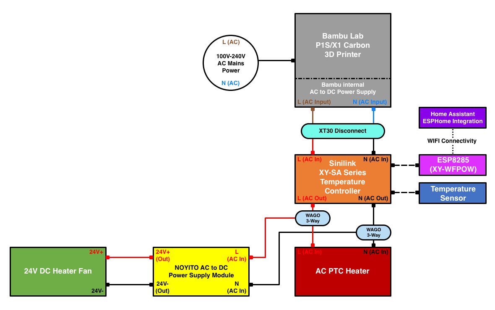
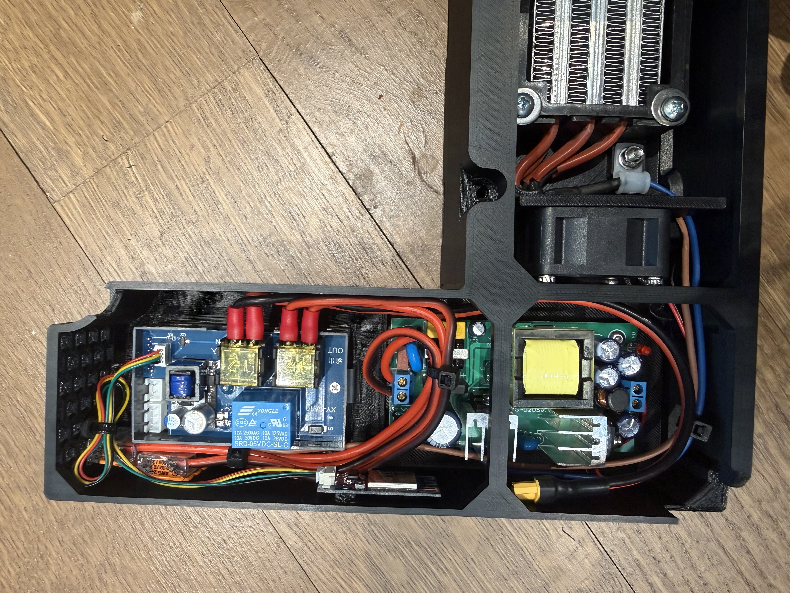
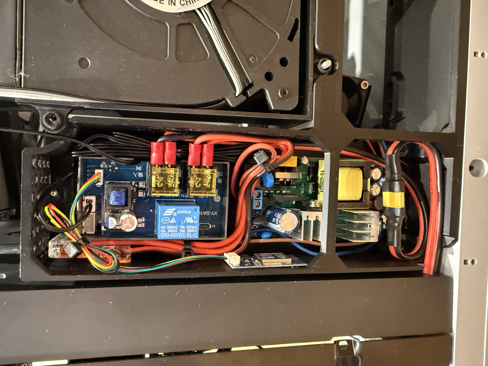
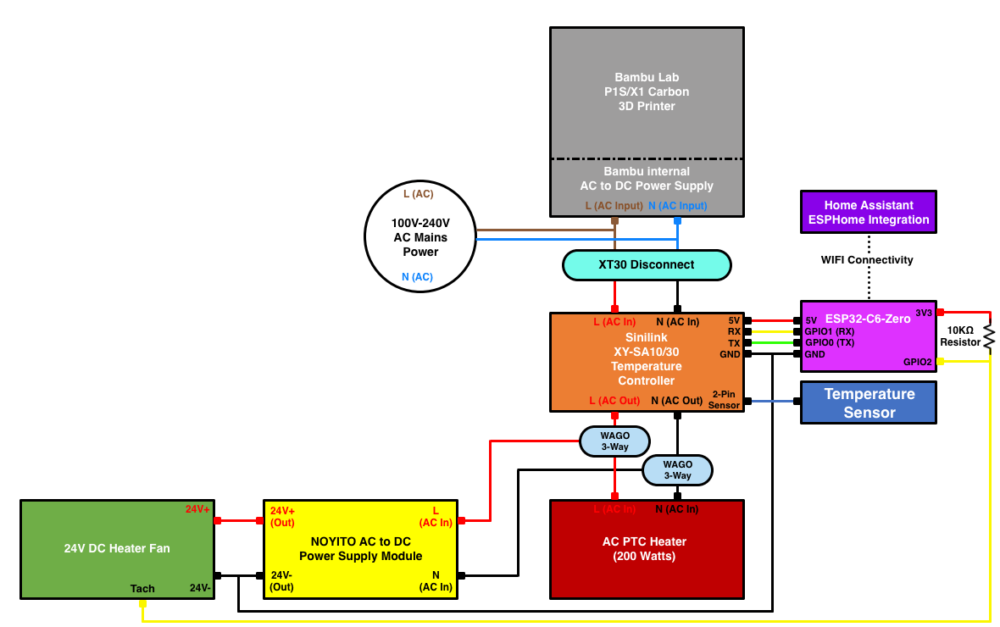
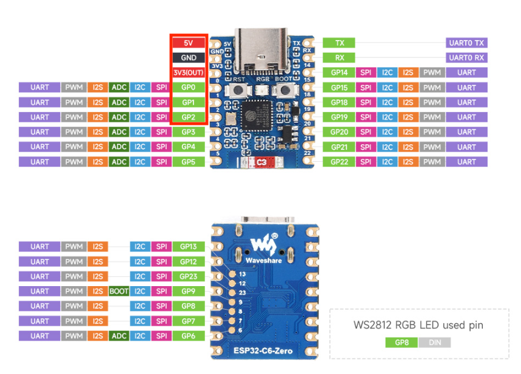
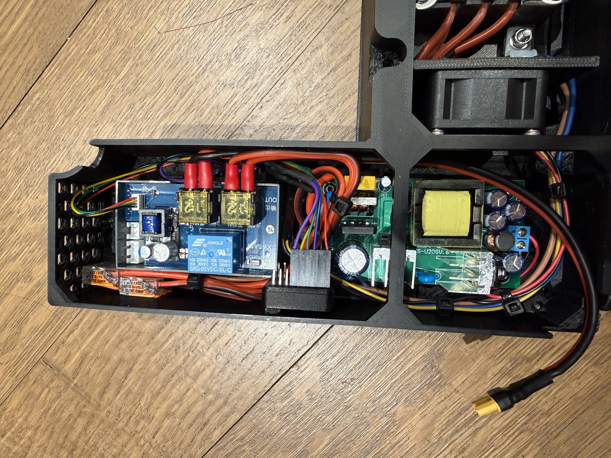
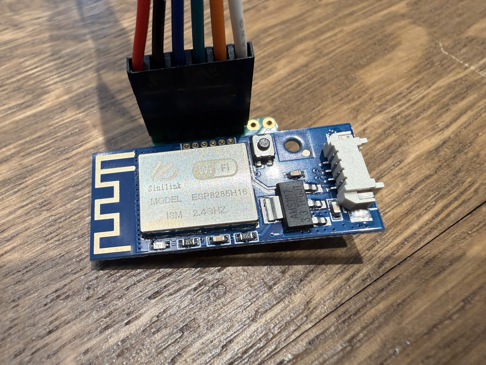
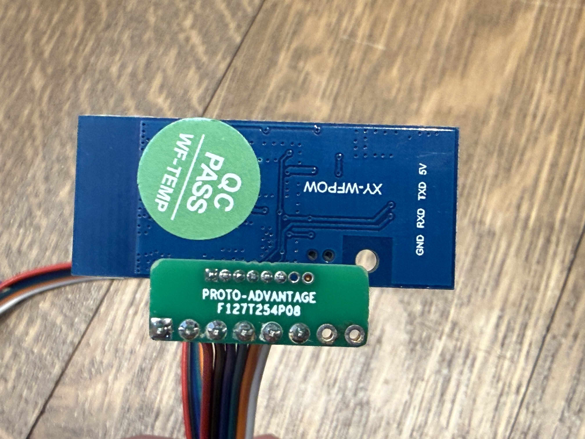
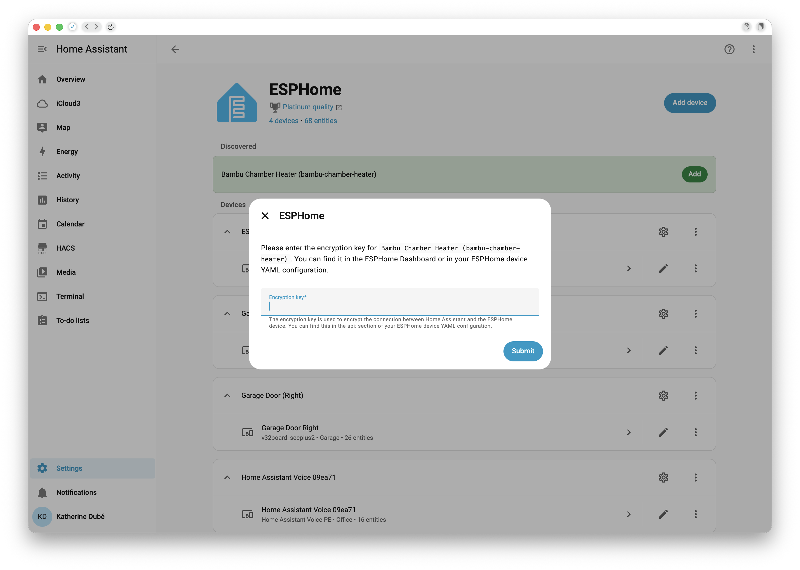
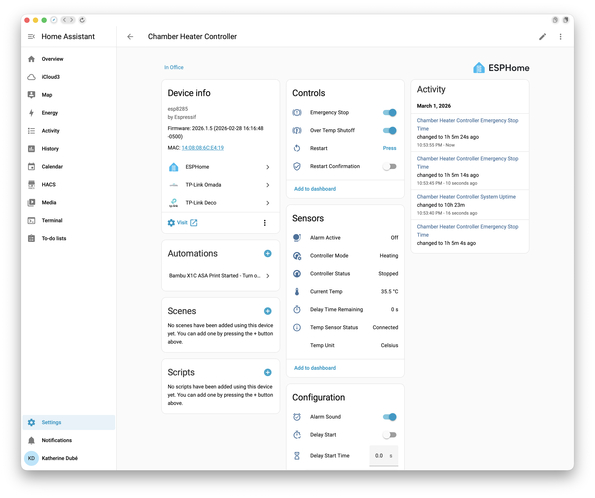

# Bambu Chamber Heater - ESPHome Temp Controller
ESPHome implementation to remotely control **Sinilink XY-SA/ST series temperature controllers** for *Bambu Lab P1S/X1 Carbon 3D printers*. The repository now supports both the **ESP8285-based XY-WFPOW** module and the **Waveshare ESP32-C6-Zero** from one shared codebase.

This project allows you to automatically manage a chamber heater, link it to print jobs, and control it through Home Assistant or the built-in web interface. It was inspired by the [BambuSauna project](https://makerworld.com/en/models/2417482-bambusauna-for-sinilink-xy-sa-st-temp-controller).


## Supported Devices

| Device | ESPHome Entry File | Notes |
| :--- | :--- | :--- |
| ESP8285 / XY-WFPOW | `esphome/temp_controller_esp8285.yaml` | Original Sinilink Wi-Fi module, built-in status LED, no fan RPM monitoring |
| ESP32-C6-Zero | `esphome/temp_controller_esp32.yaml` | External module retrofit, WS2812 status LED, fan RPM monitoring, Wi-Fi protocol sensor |
| Manual selector | `esphome/temp_controller.yaml` | Main YAML with package toggles for device and temperature unit |

## Repository Layout

- `esphome/settings.yaml` contains the shared substitutions, default build settings, and additional shared configuration options you may want to customize.
- `esphome/packages/controller_shared.yaml` contains the shared controller logic, Modbus entities, automations, and safety behavior.
- `esphome/packages/device_esp8285.yaml` contains ESP8285-only framework, GPIO, and hardware configuration.
- `esphome/packages/device_esp32_c6_zero.yaml` contains ESP32-C6-Zero-only framework, GPIO, fan monitoring, LED logic, and helper include usage.
- `esphome/packages/celsius.yaml` and `esphome/packages/fahrenheit.yaml` contain unit-specific number ranges and preset math.
- `esphome/temp_controller.yaml` is the main entrypoint if you want to switch device and unit by editing one file.
- `assets/web/` contains the custom web UI CSS and JavaScript assets used by ESPHome's web server.
- `docs/images/` contains README screenshots, wiring diagrams, and source artwork.
- `hardware/3d-models/` contains printable enclosure and adapter `.3mf` files.

## Features

### Shared Features
- ESPHome integration for Home Assistant
- Standalone web interface
- Automatic chamber temperature control based on print state and filament type
- Filament presets plus user-defined mode
- Emergency stop handling
- Over-temperature protection
- Runaway heating detection
- Sensor fault detection
- Modbus communication watchdog
- End-of-job shutoff
- Celsius and Fahrenheit builds
- OTA firmware updates

### ESP32-C6-Zero Extras
- RPM monitoring for 3-wire fans with emergency-stop interlock
- WS2812 RGB status LED with state-based colors and effects
- Wi-Fi 6 support with protocol diagnostic sensor via [include/wifi_protocol_helper.h](include/wifi_protocol_helper.h)

## Requirements

### Software
- ESPHome installed locally
- Home Assistant with the [Bambu Lab HA integration](https://github.com/greghesp/ha-bambulab)

### Common Hardware
- Bambu P1S / X1 Carbon 3D Printer
- Sinilink XY-SA10/SA30-W AC 110V-250V Temperature Controller  _ _(XY-SA10-W is recommended)_ _
- NOYITO AC 100V-264V to DC 24V 1A Power Supply Module
- AC 120/240V PTC Heater 200-250W
- (2) 3-Way WAGO Connectors
- 16-18Ga silicone wiring
- Heat set inserts: (15) M3x4x5 + (1) M2x2.5x3.2
- XT30 connector pair
- Soldering equipment

### ESP8285 Hardware
- Sinilink XY-WFPOW (ESP8285-based) wireless module
- 24V 4020 2 or 3-wire fan
- USB-to-TTL UART programmer set to 3.3V _ _(only needed for the initial flash)_ _

### ESP32-C6-Zero Hardware
- Waveshare ESP32-C6-Zero with 2 x 9-pin headers soldered
- 24V 4020 3-wire fan
- 1/4W 10K resistor for the tach pull-up
- JST MX 1.25mm 4-pin cable for the controller connection
- Assorted 2.54mm pitch housings and crimp pins
- USB-C-to-USB-C cable for the initial flash

## References
- [Sinilink XY-ST/SA Remote Thermostat Datasheet](https://myosuploads3.banggood.com/products/20240220/20240220213226STSA-EN.pdf)
- [Sinilink XY-WT04 Modbus Communication Protocol](https://myosuploads3.banggood.com/products/20220717/20220717212911XY-WT04-EN.pdf)
- [ESPhome-Sinilink-XY-WFPOW](https://github.com/creepystefan/ESPhome-Sinilink-XY-WFPOW)
- [Tasmota XY-WFPOW Template](https://templates.blakadder.com/sinilink_XY-WFPOW.html)

## Modbus Address Map

| ADDRESS | TYPE | NAME | RANGE/VALUES | Read/Write | DESCRIPTION |
| :--- | :---: | :--- | :--- | :---: | :--- |
| 0x0000 | U_WORD | Controller Status | 0=Stopped, 1=Active | RW | Main relay/controller state |
| 0x0001 | U_WORD | Temp Sensor Status | 0=Connected, 1=Disc | RO | Temperature sensor connection status |
| 0x0002 | U_WORD | Delay Time Remaining | 0-999 seconds | RO | Countdown timer for delayed start |
| 0x0003 | S_WORD | Current Temperature | -400 to 1100 (*0.1) | RO | Current measured temperature |
| 0x0004 | U_WORD | Temperature Unit | 0=Celsius, 1=Fahrenheit | RW | Display and control temperature unit |
| 0x0005 | U_WORD | Controller Mode | 0=Heating, 1=Cooling | RO | Operating mode |
| 0x0006 | S_WORD | Low Temp Threshold | -400 to 850 (*0.1) | RW | Temperature to start heating/cooling |
| 0x0007 | S_WORD | High Temp Threshold | -400 to 850 (*0.1) | RW | Temperature to stop heating/cooling |
| 0x0008 | S_WORD | High Temp Alarm | -400 to 1100 (*0.1) | RW | High temperature alarm threshold |
| 0x0009 | S_WORD | Low Temp Alarm | -400 to 1100 (*0.1) | RW | Low temperature alarm threshold |
| 0x000A | U_WORD | Delay Start Time | 0-999 seconds | RW | Delay start duration setting |
| 0x000B | S_WORD | Temperature Offset | -100 to 100 (*0.1) | RW | Temperature calibration offset |
| 0x000C | BOOL | Alarm Active | 0=No, 1=Yes | RO | Temperature alarm status |
| 0x000D | BOOL | Alarm Sound | 0=Off, 1=On | RW | Enable/disable alarm beeper |
| 0x000E | BOOL | High Temp Alarm Enable | 0=Off, 1=On | RW | Enable high temperature alarm |
| 0x000F | BOOL | Low Temp Alarm Enable | 0=Off, 1=On | RW | Enable low temperature alarm |
| 0x0010 | BOOL | Delay Start Enable | 0=Off, 1=On | RW | Enable delayed start feature |
| 0x0011 | BOOL | Emergency Stop | 0=Off, 1=On | RW | Emergency stop/disable controller |
| 0x0012 | U_WORD | Modbus Address | 1-247 | RW | Modbus slave address |
| 0x0013 | U_WORD | Modbus Baudrate | 0-6 | RW | Serial communication speed |
| 0x0014 | BOOL | Sleep Mode | 0=Off, 1=On | RW | Display sleep/power saving mode |
| 0x0015 | U_WORD | Backlight Level | 0-7 | RW | Display backlight brightness |

Baudrate map for `0x0013`: `0=9600`, `1=14400`, `2=19200`, `3=38400`, `4=56000`, `5=57600`, `6=115200`.

## Wiring and Hardware Notes

### ESP8285 / XY-WFPOW
Use the original Sinilink XY-WFPOW Wi-Fi module. The basic wiring diagram is shown below.





### ESP32-C6-Zero
The ESP32-C6-Zero retrofit uses a separate module and adds fan RPM monitoring and RGB LED status indication.







The onboard WS2812 LED on GPIO8 is used for status:

| State | Color | Effect |
| :--- | :--- | :--- |
| Emergency stop | Red | Solid |
| Wi-Fi disconnected | Blue | Fast pulse |
| Over-temperature warning | Red | Strobe |
| Heating active | Orange | Slow pulse |
| Normal idle | Green | Dim solid |

## Setup

### 1. Install ESPHome
Follow the official directions on the [ESPHome website](https://esphome.io/guides/installing_esphome/).

If you're using MacOS, the easiest way to install is via [Homebrew](https://brew.sh/) by running this command in a MacOS terminal window:
```bash
/bin/bash -c "$(curl -fsSL https://raw.githubusercontent.com/Homebrew/install/HEAD/install.sh)"
```

Now install ESPHome:
```bash
brew install esphome
```

### 2. Clone the Repository

```bash
git clone https://github.com/kedube/bambu-chamber-heater
cd bambu-chamber-heater
```

### 3. Configure Secrets
Copy and edit the secrets file:

```bash
cp esphome/secrets-example.yaml esphome/secrets.yaml
```

Important values include:
- `wifi_ssid`
- `wifi_password`
- `ap_wifi_ssid`
- `ap_wifi_password`
- `web_server_username`
- `web_server_password`
- `ota_password`
- `encryption_key`
- `bambu_printer_id`

Shared substitutions such as `device_name`, `friendly_name`, software version, filament preset defaults, and Modbus timing are now defined in `esphome/settings.yaml`.
Use that file for additional shared configuration changes before editing the controller or device packages directly.

### 4. Choose Device and Temperature Unit

If you want one editable selector file, use `esphome/temp_controller.yaml` and switch the package includes:

```yaml
packages:
  settings: !include settings.yaml
  controller_shared: !include packages/controller_shared.yaml
  select_units: !include
    file: packages/celsius.yaml
    #file: packages/fahrenheit.yaml
  select_device: !include
    file: packages/device_esp8285.yaml
    #file: packages/device_esp32_c6_zero.yaml
```

If you prefer a fixed compile target, use one of these:
- `esphome/temp_controller_esp8285.yaml`
- `esphome/temp_controller_esp32.yaml`

### 5. Validate The Configuration

```bash
esphome config esphome/temp_controller.yaml
```

### 6. Build

Example:

```bash
esphome run esphome/temp_controller.yaml
```

### 7. First Flash

### ESP8285 / XY-WFPOW
For the ESP8285, use the USB-to-TTL adapter programmer at **3.3V** and the XY-WFPOW flashing pins:

```text
GND -> GND
TXD -> RXD
RXD -> TXD
IO0 -> GND
RST -> not connected
3V3 -> VCC
```

Adapter board photos:



### ESP32-C6-Zero
For the ESP32-C6-Zero, you must connect the board via USB-C and flash it directly. It will prompt you after a successful build for where to upload the code. 

```text
INFO Build Info: config_hash=0x694d2e36 build_time_str=2026-04-01 14:02:17 -0400
INFO Successfully compiled program.
Found multiple options for uploading, please choose one:
  [1] /dev/cu.usbserial-8320 (USB Serial)
  [2] Over The Air (esp32-remote.local)
(number):
```

### Subsequent Flashes
After the initial flash, both device types can be updated over the air (OTA) using ESPHome.

### 8. Home Assistant
Once online, the device should be discovered by the ESPHome integration in Home Assistant. Use the same `encryption_key` configured in `esphome/secrets.yaml`.





## Known Issues
- The Sinilink Modbus addresses for the sleep switch (`0x0014`) and backlight level (`0x0015`) may not have any effect on some XY-SA10/SA30 controllers.
- Mixed-material prints can still cause the chamber target to change as the active filament changes.

## Safety
The author assumes no liability for injury, damage, or loss resulting from wiring errors, improper installation, or misuse of this project. Electrical work can be hazardous. If you are unsure, consult a qualified professional.

## Contributing
Contributions are welcome for bug fixes, documentation improvements, and new hardware support. Please include testing details when possible.
