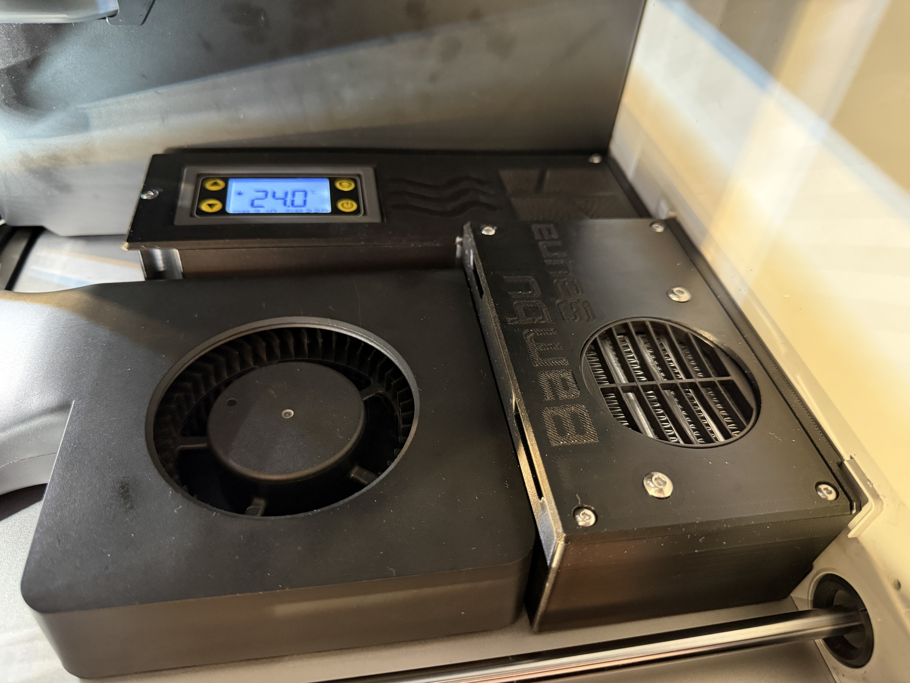
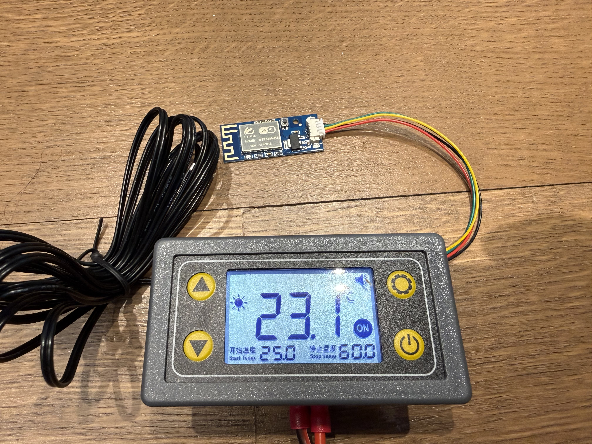
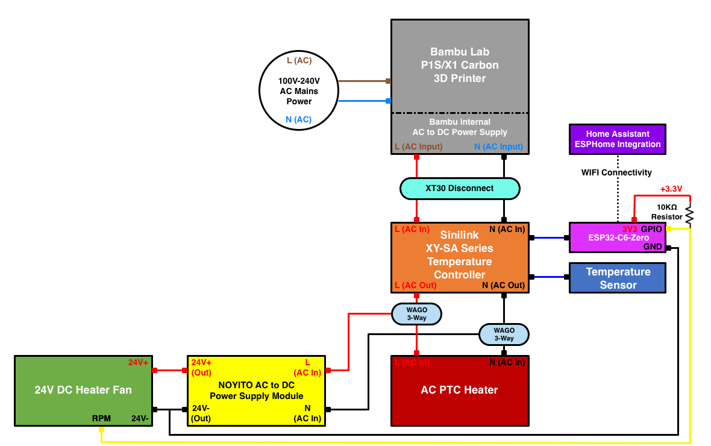
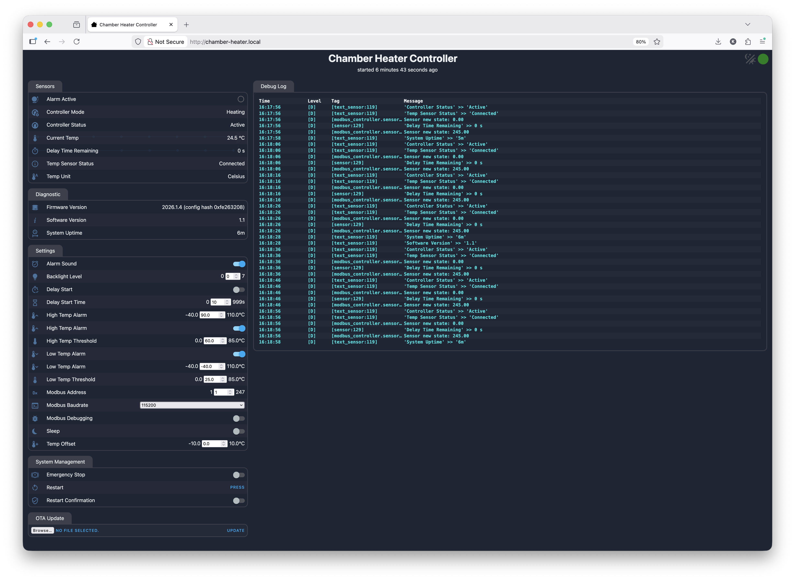

# Bambu Chamber Heater - ESPHome Controller
ESPHome implementation to remotely control **Sinilink XY-SA/ST series temperature controllers** using the **Waveshare ESP32-C6-Zero wireless module**. Designed specifically to work with *Bambu Lab P1S/X1 Carbon 3D printers* and integration with Home Assistant or managed with the web interface. 

This project allows you to intelligently manage your chamber heater by turning it on/off automatically, linking it with print jobs, and controlling it with automation scripts. Inspired by the [BambuSauna project](https://makerworld.com/en/models/2417482-bambusauna-for-sinilink-xy-sa-st-temp-controller).  




## Features

### Control & Automation
- **ESPHome Integration** - Seamless remote control and monitoring through Home Assistant
- **Web Interface** - Standalone web server with customizable UI for direct device access
- **Builtin Automation** - Temperature control based on print jobs and filament type
- **Filament Presets** - Pre-configured temperature profiles for PLA, PETG, ABS, ASA, and Nylon, plus user-defined settings

### Safety & Protection
- **Emergency Stop** - Instant heater shutdown via manual override or automated triggers
- **Over-Temperature Protection** - Automatic shutoff when temperature exceeds high alarm threshold
- **Runaway Heating Detection** - Monitors temperature rise rate and triggers emergency stop on anomalies
- **Sensor Fault Detection** - Automatic emergency stop on temperature sensor disconnection
- **Communication Watchdog** - Auto-shutoff if Modbus communication is lost for >90 seconds
- **End of Job** - Auto-shutoff when print is finished

### Status Indication
- **LED Status Indicator** - WS2812 RGB LED provides instant visual feedback of system state
  - 🔴 **Solid Red** - Emergency stop active
  - 🔵 **Pulsing Blue** - WiFi disconnected
  - 🔴 **Flashing Red** - Over temperature warning (>60°C)
  - 🟠 **Pulsing Orange** - Heater actively running
  - 🟢 **Dim Green** - Normal operation (idle/connected)

### Configuration
- **Dual Unit Support** - Switch between Celsius and Fahrenheit temperature units
- **Temperature Calibration** - Adjustable temperature offset for sensor accuracy
- **OTA Firmware Updates** - Wireless updates without physical access to the device

## Requirements
Make sure you have the following before proceeding:

### Software
- ESPHome build environment installed locally (instructions below)
- Home Assistant with [Bambu Lab HA integration](https://github.com/greghesp/ha-bambulab) installed

### Hardware
- Bambu P1S / X1 Carbon 3D Printer
- Sinilink XY-SA10/SA30-W AC 110V-250V Temperature Controller (no need to get the SA30 since the SA10 can handles nearly 5 times the amperage for a 250W heater)
- Waveshare ESP32-C6-Zero Wireless Module
- NOYITO AC 100V-264V to DC 24V 1A Power Supply Module (powers the 24V Fan only)
- AC 120/240V PTC Heater 200-250W (no need to be more powerful than this)
- 24V 4020 3-Wire Fan (Used: SUNON MF40202VX-1000U-G99 with 10.8CFM airflow)
- (2) 3-Way WAGO Connectors
- 16Ga Silicon Wiring (Used: red and black wiring) 
- 1/4 Watt 10K Ohm Resistor (for 3.3V pull-up power for tach)
- Heat set inserts: (15) M3x4x5 + (1) M2x2.5x3.2
- Screws: 
  - (7) M3x5MM or 6MM button screws for covers
  - (2) M3x25MM hex head screws for lower aux fan screws
  - (4) M3x25MM hex head screws for 24V Fan
  - (4) M3x4MM button screws for NOYITO AC to DC Power Supply Module
  - (2) M3x8MM hex head screws to connect housing to printer bottom
  - (4) M4x6MM or 8MM self-tapping screws to hold PTC in housing without fan
  - (2) M4x12MM button screws to hold the PTC heater to the front cover
  - (2) M4 self-locking nuts to connect the PTC heater to the front cover
  - (1) M2x3MM machine screw to hold the wireless module to the housing
- (1) XT30 connector pair set (both ends) to allow the chamber heater to be removed
- Heatshrink tubing (for XT30 connectors)
- Soldering equipment (depending on the installation method)
- USB-to-TTL UART Programmer (Note: I highly recommend FTDI-based programmers)

## References
- [Sinilink XY-ST/SA Remote Thermostat Datasheet](https://myosuploads3.banggood.com/products/20240220/20240220213226STSA-EN.pdf)
- [Sinilink XY-WT04 Modbus Communication Protocol](https://myosuploads3.banggood.com/products/20220717/20220717212911XY-WT04-EN.pdf)

## Modbus Address Map
Register addresses for XY-SA/ST temperature controller. All registers are 16-bit holding registers unless otherwise noted. Temperature values use signed words (S_WORD) that require a 0.1 multiplier when displaying.

| ADDRESS | TYPE   | NAME                    | RANGE/VALUES        | Read/Write | DESCRIPTION
| :---|:---:|:---|:---|:---:|:---
| 0x0000  | U_WORD | Controller Status       | 0=Stopped, 1=Active | RW | Main relay/controller state
| 0x0001  | U_WORD | Temp Sensor Status      | 0=Connected, 1=Disc | RO | Temperature sensor connection status
| 0x0002  | U_WORD | Delay Time Remaining    | 0-999 seconds       | RO | Countdown timer for delayed start
| 0x0003  | S_WORD | Current Temperature     | -400 to 1100 (*0.1) | RO | Current measured temperature
| 0x0004  | U_WORD | Temperature Unit        | 0=Celsius, 1=Fahrenheit | RW | Display and control temperature unit
| 0x0005  | U_WORD | Controller Mode         | 0=Heating, 1=Cooling| RO | Operating mode (heating vs cooling)
| 0x0006  | S_WORD | Low Temp Threshold      | -400 to 850 (*0.1)  | RW | Temperature to start heating/cooling
| 0x0007  | S_WORD | High Temp Threshold     | -400 to 850 (*0.1)  | RW | Temperature to stop heating/cooling
| 0x0008  | S_WORD | High Temp Alarm         | -400 to 1100 (*0.1) | RW | High temperature alarm threshold
| 0x0009  | S_WORD | Low Temp Alarm          | -400 to 1100 (*0.1) | RW | Low temperature alarm threshold
| 0x000A  | U_WORD | Delay Start Time        | 0-999 seconds       | RW | Delay start duration setting
| 0x000B  | S_WORD | Temperature Offset      | -100 to 100 (*0.1)  | RW | Temperature calibration offset
| 0x000C  | BOOL   | Alarm Active            | 0=No, 1=Yes         | RO | Temperature alarm status
| 0x000D  | BOOL   | Alarm Sound             | 0=Off, 1=On         | RW | Enable/disable alarm beeper
| 0x000E  | BOOL   | High Temp Alarm Enable  | 0=Off, 1=On         | RW | Enable high temperature alarm
| 0x000F  | BOOL   | Low Temp Alarm Enable   | 0=Off, 1=On         | RW | Enable low temperature alarm
| 0x0010  | BOOL   | Delay Start Enable      | 0=Off, 1=On         | RW | Enable delayed start feature
| 0x0011  | BOOL   | Emergency Stop          | 0=Off, 1=On         | RW | Emergency stop/disable controller
| 0x0012  | U_WORD | Modbus Address          | 1-247               | RW | Modbus slave address (requires reboot)
| 0x0013  | U_WORD | Modbus Baudrate         | 0-6 \<See baudrate map\>  | RW | Serial communication speed
| 0x0014  | BOOL   | Sleep Mode              | 0=Off, 1=On         | RW | Display sleep/power saving mode
| 0x0015  | U_WORD | Backlight Level         | 0-7                 | RW | Display backlight brightness (0=off)

Baudrate Map (0x0013): 0=9600, 1=14400, 2=19200, 3=38400, 4=56000, 5=57600, 6=115200

Temperature Value Encoding:
   - Stored as signed 16-bit integers representing temperature in tenths of degrees
   - Actual temperature = register_value * 0.1
   - Example: register value 235 = 23.5°C

Safety Notes:
   - Always enable high temp alarm (0x000E) for safety
   - Set high temp alarm (0x0008) above normal operating range
   - Emergency stop (0x0011) immediately disables heating/cooling

## Wiring Diagram
Here is a basic wiring diagram for AC-powered Sinilink XY-SA Series Temperature Controllers. The Sinilink XY-ST Series Temperature Controllers are DC-powered and require an external 24V power supply and entirely different wiring schematic. 




Disclaimer: The author assumes no liability for any injury, damage, or loss resulting from wiring errors, improper installation, or misuse of this project. Electrical work can be hazardous—if you are unsure, consult a qualified professional before proceeding.

## Setup & Installation

### 1. Install ESPHome
Follow the instructions at the official ESPHome website: [ESPHome.io website](https://esphome.io/guides/installing_esphome/).

If you're using MacOS, the easiest way to install is via [Homebrew](https://brew.sh/) by running this command in a MacOS terminal window:
```
/bin/bash -c "$(curl -fsSL https://raw.githubusercontent.com/Homebrew/install/HEAD/install.sh)"
```
Now install ESPHome:
```
brew install esphome
```

### 2. Clone Repository
```
git clone https://github.com/kedube/bambu-chamber-heater
cd bambu-chamber-heater
```

### 3. Configure Secrets & Settings
Copy the default secrets file and update it with your credentials & Wi-Fi:
```
cp secrets-example.yaml secrets.yaml
```

Configurable settings:
```
# Update the following secrets with your own values.
location_name: "Office"
wifi_ssid: ""
wifi_password: ""
ap_wifi_ssid: "chamber-heater"
ap_wifi_password: ""
web_server_username: "admin"
web_server_password: ""
ota_password: ""
# Generate a random 32-byte encryption key for the API and paste it here or visit https://esphome.io/components/api/ to generate one. 
# This is required if you want to use integrate with Home Assistant.
encryption_key: ""
# Bambu printer ID only (without "binary_sensor." and without "_online"),
# e.g. "x1c_00x00b123401012" which becomes "binary_sensor.x1c_00x00b123401012_online"
bambu_printer_id: ""
# Static IP configuration (uncomment and set values if needed)
#static_ip: ""
#gateway: ""
#subnet: ""
#dns1: ""
#dns2: ""
```

Generate a valid 32-byte encryption key (see: [ESPHome.io](https://esphome.io/components/api/)), and insert it under `encryption_key`.

In temperature_controller.yaml, there are also a number of settings you can configure if you like in the substitutions: section:
```
substitutions:
  device_name: "chamber-heater"
  friendly_name: "Chamber Heater Controller"
  device_description: "ESP32-based Modbus interface for Sinilink XY-SA/ST temperature controllers"
  device_area: "Office"
  bambu_printer_entity_id: !secret bambu_printer_id
  sw_version: "1.6.0"
  pla_temp: "22" # Degrees Celsius - adjust as needed for your specific filament and printer setup
  tpu_temp: "25" # Degrees Celsius - adjust as needed for your specific filament and printer setup
  petg_temp: "35" # Degrees Celsius - adjust as needed for your specific filament and printer setup
  pctg_temp: "35" # Degrees Celsius - adjust as needed for your specific filament and printer setup
  abs_temp: "55" # Degrees Celsius - adjust as needed for your specific filament and printer setup
  asa_temp: "55" # Degrees Celsius - adjust as needed for your specific filament and printer setup
  pc_temp: "80" # Degrees Celsius - adjust as needed for your specific filament and printer setup
  pet_temp: "50" # Degrees Celsius - adjust as needed for your specific filament and printer setup
  pa_temp: "60" # Degrees Celsius - adjust as needed for your specific filament and printer setup
  pa6_temp: "80" # Degrees Celsius - adjust as needed for your specific filament and printer setup
  pa12_temp: "60" # Degrees Celsius - adjust as needed for your specific filament and printer setup
  pa612_temp: "25" # Degrees Celsius - adjust as needed for your specific filament and printer setup
  ppa_temp: "70" # Degrees Celsius - adjust as needed for your specific filament and printer setup
  pps_temp: "80" # Degrees Celsius - adjust as needed for your specific filament and printer setup
  pp_temp: "55" # Degrees Celsius - adjust as needed for your specific filament and printer setup
  pe_temp: "75" # Degrees Celsius - adjust as needed for your specific filament and printer setup
  paht_temp: "55" # Degrees Celsius - adjust as needed for your specific filament and printer setup
```

### 4. Choose Temperature Unit
By default, the code uses Celsius. To use Fahrenheit, uncomment the appropriate yaml package in 'temperature_controller.yaml':
```
packages:
  select_units: !include 
    # Select the appropriate temperature unit file to include based on your preference. 
    # Both files define the same entities, but with different units and value ranges.
    #file: celsius.yaml
    file: fahrenheit.yaml
```

### 5. Compile the yaml files
Compile the ESPHome code:
```
esphome run temperature_controller.yaml
```

### 6. Flash the ESP32-C6-Zero module with ESPHome

Once ESPHome successfully compiles the YAML configuration, it will prompt you to flash the **ESP32** module if the module is connected via USB-C to your computer.

```
Linking .pioenvs/bambu-chamber-heater/firmware.elf
RAM:   [====      ]  44.4% (used 36380 bytes from 81920 bytes)
Flash: [=====     ]  54.9% (used 562413 bytes from 1023984 bytes)
Building .pioenvs/bambu-chamber-heater/firmware.bin
esp8266_copy_factory_bin([".pioenvs/bambu-chamber-heater/firmware.bin"], [".pioenvs/bambu-chamber-heater/firmware.elf"])
esp8266_copy_ota_bin([".pioenvs/bambu-chamber-heater/firmware.bin"], [".pioenvs/bambu-chamber-heater/firmware.elf"])
========================================================================== [SUCCESS] Took 30.71 seconds ==========================================================================
INFO Successfully compiled program.
Found multiple options for uploading, please choose one:
  [1] /dev/cu.usbserial-BG031LIB (FT232R USB UART)
  [2] Over The Air (chamber-heater.local)
(number): 1
esptool v5.1.0
Connected to ESP8266 on /dev/cu.usbserial-BG031LIB:
Chip type:          ESP8285H16
Features:           Wi-Fi, 160MHz, Embedded Flash
Crystal frequency:  26MHz
MAC:                14:08:08:6c:e4:19

Stub flasher running.
Changing baud rate to 460800...
Changed.

Configuring flash size...
Auto-detected flash size: 2MB
Flash will be erased from 0x00000000 to 0x0008afff...
Flash parameters set to 0x0330.
Compressed 566560 bytes to 396530...
Wrote 566560 bytes (396530 compressed) at 0x00000000 in 9.6 seconds (473.6 kbit/s).
Hash of data verified.

Hard resetting via RTS pin...
INFO Successfully uploaded program.
INFO UART logging is disabled (baud_rate=0). Not starting UART logs.
```

A USB-C connection is required **only for the initial flash**. After that, all future updates can be deployed using **ESPHome Over-The-Air (OTA)** once the configuration compiles successfully.

```
Linking .pioenvs/bambu-chamber-heater/firmware.elf
RAM:   [====      ]  44.4% (used 36380 bytes from 81920 bytes)
Flash: [=====     ]  54.9% (used 562413 bytes from 1023984 bytes)
Building .pioenvs/bambu-chamber-heater/firmware.bin
esp8266_copy_factory_bin([".pioenvs/bambu-chamber-heater/firmware.bin"], [".pioenvs/bambu-chamber-heater/firmware.elf"])
esp8266_copy_ota_bin([".pioenvs/bambu-chamber-heater/firmware.bin"], [".pioenvs/bambu-chamber-heater/firmware.elf"])
========================================================================== [SUCCESS] Took 3.38 seconds ==========================================================================
INFO Successfully compiled program.
INFO Connecting to 192.168.1.27 port 8266...
INFO Connected to 192.168.1.27
INFO Uploading /Users/username/Downloads/sinilink_temperature_controller/.esphome/build/bambu-chamber-heater/.pioenvs/bambu-chamber-heater/firmware.bin (566560 bytes)
INFO Compressed to 396547 bytes
Uploading: [============================================================] 100% Done...

INFO Upload took 5.84 seconds, waiting for result...
INFO OTA successful
INFO Successfully uploaded program.
INFO Starting log output from 192.168.1.27 using esphome API
INFO Successfully resolved bambu-chamber-heater @ 192.168.1.27 in 0.000s
INFO Trying to connect to bambu-chamber-heater @ 192.168.1.27 in the background
INFO Successfully connected to bambu-chamber-heater @ 192.168.1.27 in 0.034s
INFO Successful handshake with bambu-chamber-heater @ 192.168.1.27 in 2.847s
```

### 6. Connect to the web server running on the ESP32 module
To control the heater, adjust the **Low (start)** and **High (stop)** temperature thresholds.
You can also use the **Emergency Stop** switch as a manual override to immediately enable or disable the heater.

The onboard **WS2812 RGB LED** (connected to GPIO8) provides real-time visual status feedback:

| LED State | Color | Effect | Meaning |
|-----------|-------|--------|---------|
| Emergency Stop | Red | Solid | System emergency stopped |
| WiFi Disconnected | Blue | Fast Pulse | Network connection lost |
| Over Temperature | Red | Strobe | Temperature >60°C warning |
| Heating Active | Orange | Slow Pulse | Heater is running |
| Normal/Idle | Green | Solid (dim) | Everything OK |

The LED updates automatically every 2 seconds and immediately responds to WiFi and emergency stop state changes, providing at-a-glance status without needing to check the web interface or Home Assistant.



### 7. Configure ESPHome integration with Home Assistant
Once the **ESP32** module is installed and online, Home Assistant should automatically discover it through the **ESPHome** integration.
ion.

Enter the same **encryption key** you defined in the `secrets.yaml` configuration file.


You can now remotely monitor and manage the temperature controller directly from Home Assistant.


By default, when a print starts, the controller checks the selected filament type. If it matches one of the configured presets, the system automatically sets the appropriate chamber temperature and enables the heater.

When the print completes or fails, the chamber heater is automatically turned off. No need to manually create automation scripts in Home Assistant. 

## Known Issues
- The Sinilink Modbus addresses for **Sleep Switch** (`0x0014`) and **Backlight Grade** (`0x0015`) do not appear to have any effect. This may be due to limitations in the XY-SA10/SA30 controllers I have been using for development, or to a misinterpretation of Modbus address information. I've commented this out for the time being.
- If you mix filament types on the same build plate (for example, using PETG supports with PLA), the chamber heater will fluctuate between temperatures based on the filament type you're printing with. 

## Contributing
Contributions are welcome!
- Bug fixes
- Documentation improvements
- New features or hardware support
Please open an issue or pull request and include testing details when possible.
